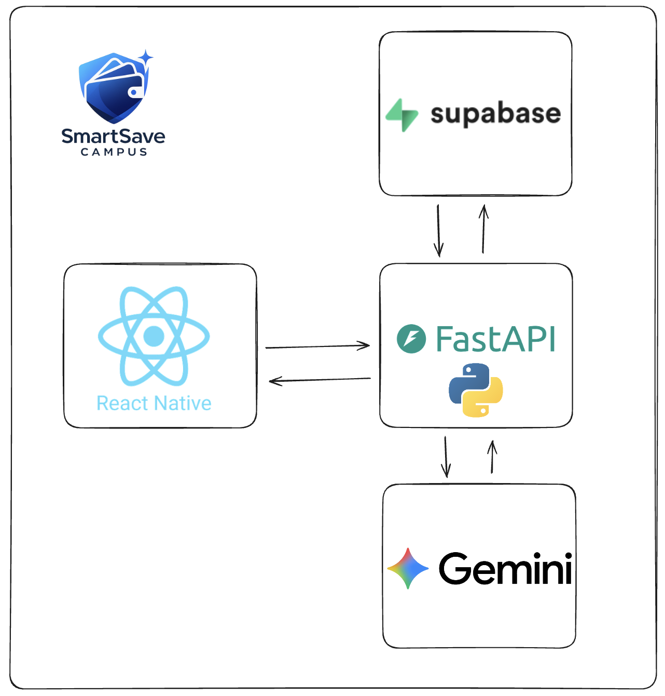

## Inspiration

College students juggle tight budgets, social lives, and campus expenses without great tools designed specifically for them. We wanted to make it **fun and rewarding** to build healthy money habits on campus, not just track numbers in a boring banking app. SmartSave Campus was born from asking: _what if budgeting felt like a game, with a coach in your pocket and your friends on a leaderboard?_

## What it does

  
  

SmartSave Campus is a mobile app that helps students **spend smarter on campus**:

- **Track spending vs budget**: See weekly and monthly spending against simple goals.
- **Savings leaderboard**: Compete with friends and classmates on a "top savers" board and track your rank.
- **AI helper before buying**: Chat with an AI spending coach that suggests cheaper alternatives, sanity-checks purchases, and highlights tradeoffs.
- **Mock campus payments**: “Pay” for campus items (coffee, snacks, transport, events, etc.) through a mock Stripe-style flow so we can demo the experience without real money.
- **Visual insights**: Simple charts and summaries so students quickly see where their money goes.

Main app tabs:

- **Home** – balances, this week’s spend, quick actions.
- **Tips** – history, categories, and a simple chart of spending trends.
- **Leaderboard** – top savers, your rank, and badges/achievements.
- **Events** – campus events.
- **AI Helper** – a chat interface with the spending coach.

## How we built it

- **Frontend (mobile)**: Built with **React Native** and **Expo**, using TypeScript and a tab-based navigation layout for the core screens (Home, Explore/Spending, Leaderboard, AI, etc.).
- **UI/UX**: Custom components for cards, lists, and charts designed to feel like a modern banking app but simplified for students (balances, budgets, quick actions).
- **Backend**: A **Python FastAPI** service that powers API endpoints for transactions, student profiles, events, leaderboard data, and AI interactions.
- **AI**: The AI tab calls backend endpoints that wrap LLM - Gemini logic to give contextual spending advice and explanations tailored to a student’s recent activity.
- **Data layer**: Simple models for users, transactions, budgets, and leaderboard stats; mocked and/or seeded data to make the demo feel realistic.
- **Tooling**: Expo dev tools for the app, and standard Python tooling (virtualenv, requirements.txt) for the backend.

## Challenges we ran into

- **Designing the right incentives**: Balancing fun, competition, and real financial responsibility without turning money into a stressful scoreboard.
- **Data modeling**: Making a simple but flexible model that can handle budgets, categories, events, and leaderboard logic without over-engineering for a hackathon.
- **AI coaching UX**: Figuring out how and when students would actually use an AI helper before purchases, and how to keep the chat short, actionable, and non-judgmental.
- **Time and integration**: Connecting the mobile UI to the backend APIs, handling async calls, and keeping the demo stable within hackathon time constraints.

## Accomplishments that we're proud of

- **End-to-end experience**: We built a full flow from a student opening the app, seeing their balances, chatting with an AI coach, and “paying” for campus items.
- **Polished UI**: The app feels like something a student could actually download and use, with intentional navigation, cards, and clear summaries.
- **Meaningful AI use**: Instead of using AI just for chat, we focused on **behavioral nudges**—helping students reason about tradeoffs, savings, and goals.
- **Gamified savings**: The leaderboard and badges make saving feel like a group challenge, not a lonely spreadsheet.

## What we learned

- **Students need context, not just numbers**: Raw transaction data isn’t enough—students want clear “what this means for me” insights.
- **AI works best with structure**: The AI responses are most helpful when we frame the conversation around goals, budgets, and concrete purchase decisions.
- **Good UX beats complexity**: Simple, well-designed views for spending and budgets matter more than advanced financial features in a hackathon setting.
- **Team workflow**: We improved at splitting frontend, backend, and AI work while keeping API contracts and design consistent.

## What's next for SmartSave

- **Richer budgeting**: Add recurring bills, savings goals, and alerts when you’re close to overspending in a category.
- **Deeper campus integrations**: Pull in real campus data like dining dollars, print quotas, and event tickets (with university APIs where possible).
- **Smarter AI coaching**: Personalize recommendations based on long-term patterns, academic calendar (midterms, breaks), and student goals (saving for trips, textbooks, etc.).
- **Social features**: Allow small groups (clubs, roommates, friends) to set shared savings challenges and celebrate milestones together.
- **Real payments**: Explore a path from mock payments to sandboxed or partner-powered real transactions in a safe, regulated way.
